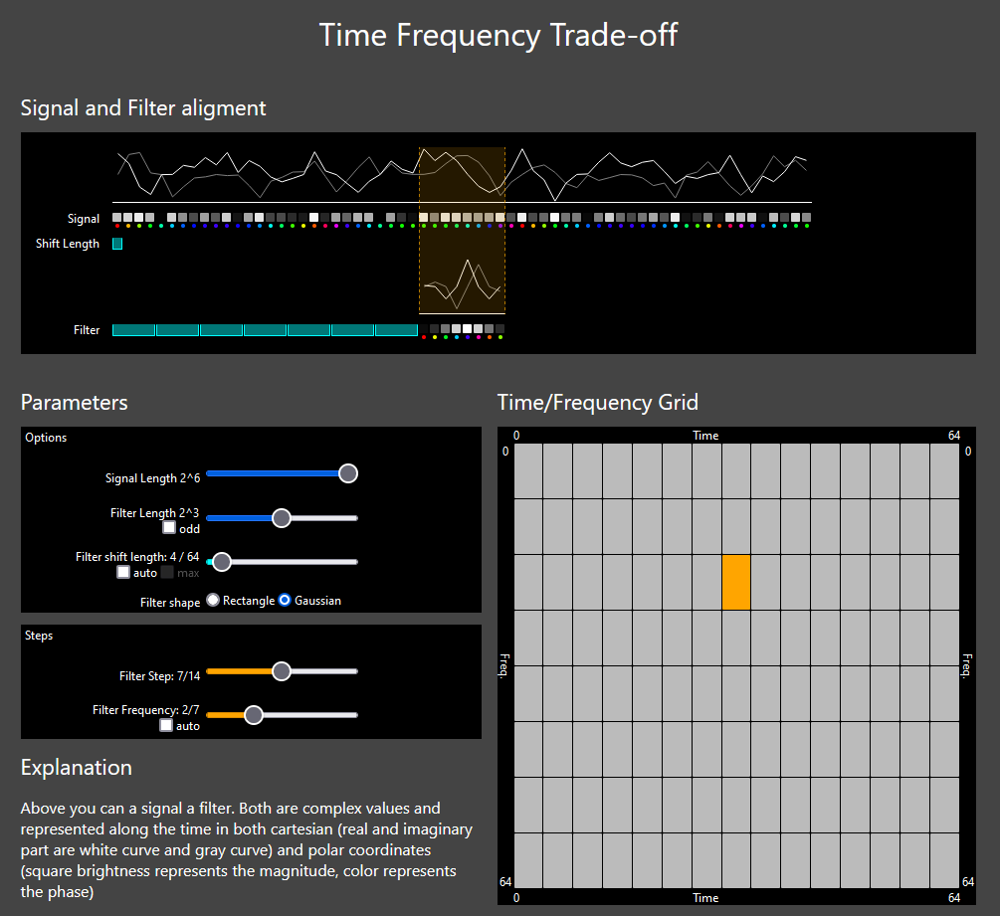

[Live Demo](https://static.laszlokorte.de/time-frequency/)

# Time Frequency Trade-off

Above you can a signal a filter. Both are complex values and represented along the time in both cartesian (real and imaginary part are white curve and gray curve) and polar coordinates (square brightness represents the magnitude, color represents the phase)

You can configure the size and shape of the filter and shift it across the signal. Depending on size of the filter and the shift length the filter can be placed at a number of positions along the signal. At each possible position the dot product between the filter values and the signal values at that position can be calculated as a measure of how well the filter fits the signal or rather how similar the filter shape is to the the signal.

Also depending on length of the filter the filter can represent a number of frequencies. A long filter consists of a higher number of values that can be used to form a higher number of sinusoids.

All possible combinations filter positions and filter frequencies are shown in the time frequency grid. As you can see the length of the filter influences the number of positions and the number of frequencies. The total number of bins in the grid is limited.

A short filter can only detect high frequencies because low frequencies (long period lengths) do not fit inside the filter. A wide filter can detect both high and low frequencies because it can represent both high and low frequencies. But the computation cost is increased because more numbers need to be multiplied or it has to be shifted across the signal in larger steps which decreases the temporal resolution.

So applying a filter is a trade-off between number of frequencies to match, number of time positions and computational complexity. The classic DFT uses a single filter size that matches length of the signal and a list of a all frequencies that fit into the fitler. The short time fourier transform (STFT) uses a shorter filter of fixed size and fixed shift length to slide across the signal to then compute all resulting time/frequency bins. So the STFT decreases the number of frequncy bins in order to increase the number of time bins compared to the DFT. The wavelet transform slides filters of different lenths across the signal but uses only a single fixed filter frequency per filter size. Typically for each filter size only the lowest (none zero) frequency is used because higher frequencies are detected by the shorter filters anyway.

In that way the wavelet transform targets the optimal trade-off between time and frequency resolutions. Check the audo option for the filter frequency and the auto and max options for the shift length and then play with the filter length option to see which frequency bins the wavelet transform calculates.

One additional perspective to consider is the following: The original signal consists only of N=64 samples. So whatever the filter does it can not extract more information from the signal than it already contains. So any more than 64 result bins hint at a waste of computation and redundancy. When maximizing the shift length the time/frequency grid consists of 64 bins for any chosen window size. When - as in the wavelet transform - you take only a single filter frequency per filter size you can see how the selected bins in the grid do not overlap and they approach to cover the whole time frequency plain.
